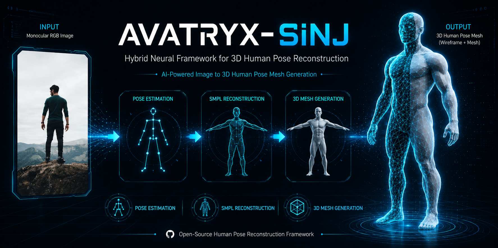
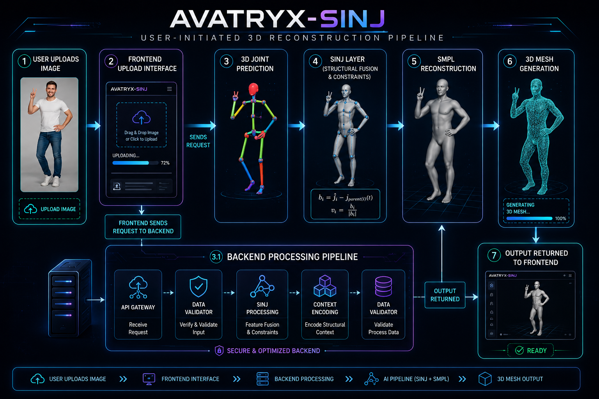
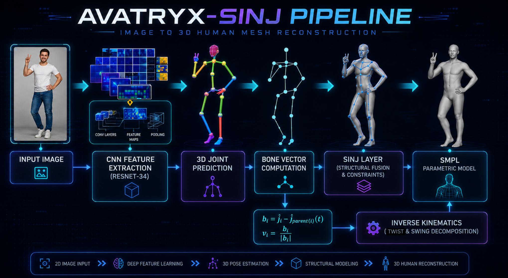
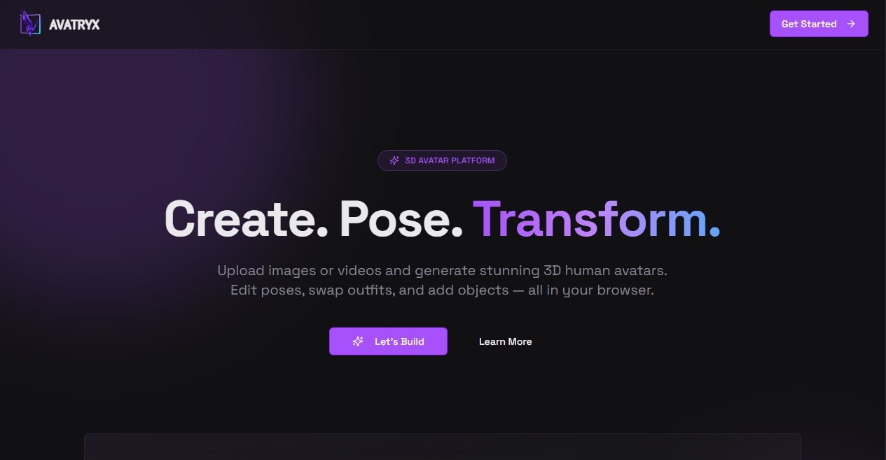
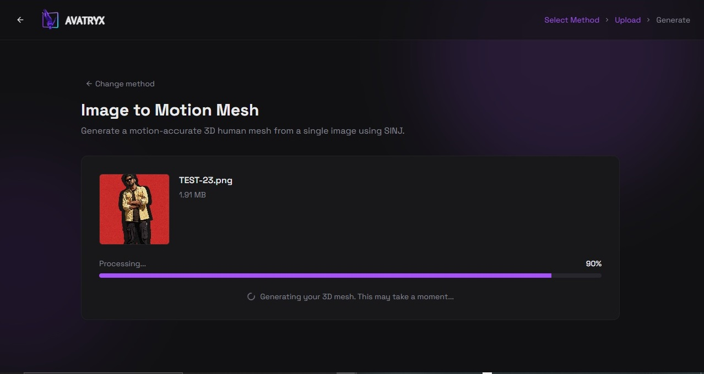
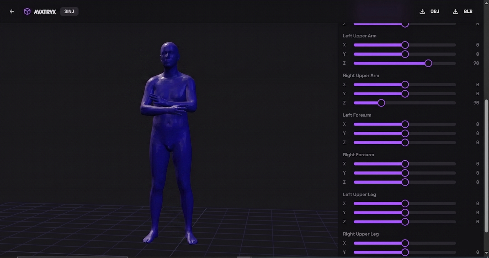
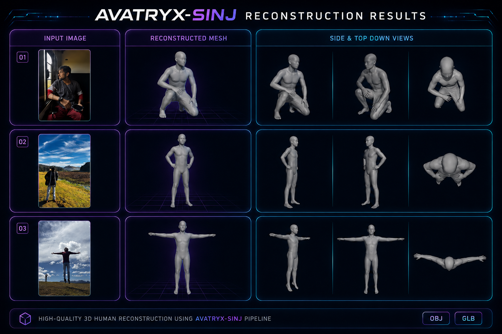

<p al<p align="center">
  
</p>

<h1 align="center">AVATRYX-SINJ</h1>

<h3 align="center">
Hybrid Neural Framework for Image-to-3D Human Pose Reconstruction
</h3>

<p align="center">
AI-Powered Image to 3D Human Pose Mesh Generation
</p>

<p align="center">
  
  
  
  
  
  
</p>

---

# Demo

<p align="center">
  
</p>

<p align="center">
  <i>AVATRYX-SINJ end-to-end workflow: image upload → pose estimation → 3D mesh reconstruction → interactive mesh viewer.</i>
</p>
<p align="center">

* Monocular Human Reconstruction
* Structural Skeletal Reasoning
* Inverse Kinematics Refinement
* SMPL Human Modeling
* Browser-Based 3D Viewer

</p>

---

# Overview

AVATRYX-SINJ is a hybrid analytical-neural framework for reconstructing anatomically consistent 3D human meshes from a single monocular RGB image.

The framework combines deep feature extraction, structural skeletal reasoning, inverse kinematics, and SMPL-based human modeling to generate realistic and physically plausible 3D human reconstructions.

Unlike conventional pose estimation systems that stop at sparse keypoint prediction, AVATRYX-SINJ reconstructs complete 3D human body geometry while preserving skeletal hierarchy, bone consistency, and articulated pose structure.

At the core of the framework is the **SINJ (Synthetic Intelligence Network Junction) Layer**, a structural fusion module that bridges neural prediction with analytical kinematic reasoning to improve reconstruction stability, structural consistency, and pose realism.

The system is deployed through a browser-based interface that allows users to upload an image, generate a 3D human mesh, interact with the reconstructed model, and export the final result in standard 3D formats.

---

# Key Features

- Image-to-3D Human Pose Reconstruction
- Hybrid Analytical-Neural Pipeline
- SINJ Structural Fusion Layer
- Bone Vector-Based Skeletal Refinement
- Twist & Swing Decomposition
- Inverse Kinematics Pose Correction
- SMPL Parametric Human Body Modeling
- Browser-Based Interactive Interface
- Real-Time 3D Mesh Viewer
- OBJ & GLB Export Support
- End-to-End Image-to-3D Reconstruction

---

# Complete Workflow

<p align="center">
  
</p>

<p align="center">
  <i>
  End-to-end system workflow showing image upload, frontend interaction,
  backend processing, SINJ reconstruction, SMPL generation, and final 3D mesh delivery.
  </i>
</p>

---

# SINJ Core Architecture

<p align="center">
  
</p>

<p align="center">
  <i>
  Core AVATRYX-SINJ reconstruction pipeline illustrating feature extraction,
  3D joint prediction, bone vector computation, SINJ structural fusion,
  inverse kinematics refinement, and SMPL-based human mesh generation.
  </i>
</p>

---

### Pipeline Stages

1. **CNN Feature Extraction** extracts visual representations from the input image.
2. **3D Joint Prediction** estimates coarse human skeletal structure.
3. **Bone Vector Computation** models structural relationships between joints.
4. **SINJ Layer** applies analytical constraints and structural fusion.
5. **Inverse Kinematics Refinement** improves anatomical consistency.
6. **SMPL Reconstruction** generates the final articulated 3D human mesh.

---

# User Interface Showcase

<table>
<tr>
<td width="33%">

### Landing Page


</td>

<td width="33%">

### Upload & Reconstruction


</td>

<td width="33%">

### Interactive Mesh Viewer


</td>
</tr>
</table>

<p align="center">
<i>
Modern browser-based interface supporting image upload,
3D reconstruction, mesh visualization, pose manipulation,
and model export.
</i>
</p>

---

# Reconstruction Results

<p align="center">
  
</p>

<p align="center">
  <i>
  Example reconstruction results generated by AVATRYX-SINJ showing input images,
  reconstructed human meshes, and multiple viewing angles for qualitative evaluation.
  </i>
</p>

---
# Research Contribution

AVATRYX-SINJ introduces a hybrid analytical-neural reconstruction framework that combines deep feature learning with structural skeletal reasoning to generate anatomically consistent 3D human meshes from a single monocular RGB image.

Unlike conventional pose estimation systems that stop at sparse keypoint prediction, AVATRYX-SINJ performs complete human mesh reconstruction through a multi-stage pipeline incorporating skeletal constraints, bone vector analysis, inverse kinematics refinement, and SMPL-based human body modeling.

The core innovation of the framework is the **SINJ (Synthetic Intelligence Network Junction) Layer**, which acts as a structural fusion module between neural predictions and analytical human body constraints.

### Key Contributions

- Hybrid analytical-neural reconstruction architecture
- Structural fusion through the SINJ Layer
- Bone vector–based skeletal consistency enforcement
- Inverse kinematics pose refinement
- SMPL-driven anatomically plausible mesh generation
- Interactive browser-based 3D visualization and editing
- End-to-end image-to-human-mesh reconstruction pipeline

The framework is designed to bridge the gap between deep learning–based pose estimation and physically consistent human body reconstruction.

---

# Project Structure

```text
AVATRYX-SINJ
│
├── assets/                 # README assets, banners, diagrams, screenshots
├── client/                 # Frontend application and user interface
├── server/                 # Backend services and API endpoints
├── shared/                 # Shared utilities and common modules
├── SINJ/                   # Core reconstruction framework and models
├── uploads/meshes/                # Uploaded images and generated meshes
│
├── package.json            # Node.js dependencies
├── requirements.txt        # Python dependencies
├── README.md               # Project documentation
│
└── Project Configuration Files
    ├── vite.config.ts
    ├── tailwind.config.ts
    ├── drizzle.config.ts
    ├── tsconfig.json
    └── postcss.config.js
```

## Requirements

- Windows 10/11 is the tested development target.
- Node.js 20 or newer.
- Python 3.9.x. Python 3.9 is recommended because the pinned ML dependencies were verified against it.
- Git.
- A machine capable of running PyTorch. CPU may work for the image demo, but GPU/CUDA is strongly recommended for usable performance.

## Important Path Rule

You do not need to edit source code paths after cloning.

Run Node commands from the repository root:

```powershell
cd AVATRYX-SINJ
```

The backend uses repo-relative paths such as `SINJ/scripts/demo_image.py` and `SINJ/pretrained_models/sinj_hrnet.pth`. If you create the Python environment at `SINJ/sinj-env`, the app works without any local path edits.

If you keep your Python environment somewhere else, set `SINJ_PYTHON` to the full path of that environment's Python executable.

## Installation

### 1. Clone the repository

```powershell
git clone https://github.com/your-username/AVATRYX-SINJ.git
cd AVATRYX-SINJ
```

### 2. Install Node dependencies

Install once from the repository root. Do not run separate `npm install` commands inside `client/` or `server/`.

```powershell
npm install
```

### 3. Create the Python environment

The backend looks for Python at `SINJ/sinj-env` by default.

```powershell
python -m venv SINJ\sinj-env
SINJ\sinj-env\Scripts\python.exe -m pip install --upgrade pip setuptools wheel
SINJ\sinj-env\Scripts\python.exe -m pip install -r requirements.txt
```

For macOS/Linux:

```bash
python3.9 -m venv SINJ/sinj-env
SINJ/sinj-env/bin/python -m pip install --upgrade pip setuptools wheel
SINJ/sinj-env/bin/python -m pip install -r requirements.txt
```

### 4. Add model files

Large model files are intentionally excluded from GitHub due to file size limitations. You must download the required weights and model files from Google Drive and place them into the correct directories. 

> ⚠️ **Important:** The application will fail during mesh generation if `sinj_hrnet.pth` or the required SMPL/SMPL-X model files are missing.

---

#### 📁 Pretrained SINJ Checkpoint
* **Download:** [Google Drive - Pretrained Models](https://drive.google.com/drive/folders/1cHOISs4S1NYFXqEJMf2MtfU6LLIGE24Y?usp=drive_link)
* **Destination:** Place the `sinj_hrnet.pth` file here:
  ```text
  SINJ/pretrained_models/sinj_hrnet.pth

#### 📁 SMPL / SMPL-X Files
* **Download:** [Google Drive - Model Files](https://drive.google.com/drive/folders/1dluS8SSXLdYDVghl9_N7zls7b12xVmbg?usp=sharing)
* **Destination:**  Place the required model files inside:

Plaintext
SINJ/model_files/
For additional setup details, please check the helper notes provided in:

* **SINJ/pretrained_models/README.md**
* **SINJ/model_files/README.md**

### 5. Environment variables

For normal local development, no `.env` file is required.

Optional variables:

```env
PORT=5000
SINJ_PYTHON=C:\absolute\path\to\python.exe
```

Use `SINJ_PYTHON` only if your virtual environment is not located at `SINJ/sinj-env`.

## Running the App

Start the full development server from the repository root:

```powershell
npm run dev
```

Open:

```text
http://localhost:5000
```

The same server handles:

- React frontend
- Express API
- Uploaded files
- SINJ Python mesh generation

## Production Build

Build:

```powershell
npm run build
```

Run:

```powershell
npm start
```

If deploying to a host, make sure the host includes:

- Node dependencies installed with `npm install`
- Python dependencies installed from `requirements.txt`
- `SINJ/pretrained_models/sinj_hrnet.pth`
- Required `SINJ/model_files/` assets
- A valid `SINJ_PYTHON` value if the Python environment is not at `SINJ/sinj-env`

## Quick Health Checks

Check TypeScript:

```powershell
npm run check
```

Check that SINJ imports from the repo root:

```powershell
SINJ\sinj-env\Scripts\python.exe -c "import SINJ; print('SINJ import OK')"
```

Check that the checkpoint exists:

```powershell
Test-Path SINJ\pretrained_models\sinj_hrnet.pth
```

## Common Issues

### `SINJ Python interpreter not found`

Create the expected virtual environment:

```powershell
python -m venv SINJ\sinj-env
SINJ\sinj-env\Scripts\python.exe -m pip install -r requirements.txt
```

Or set `SINJ_PYTHON` to your Python executable path.

### `SINJ checkpoint missing`

Download/copy the model file and make sure the filename is exactly:

```text
SINJ/pretrained_models/sinj_hrnet.pth
```

### `No OBJ generated`

Usually one of these is missing or incompatible:

- `sinj_hrnet.pth`
- SMPL model files in `SINJ/model_files/`
- Python dependencies
- CUDA/PyTorch setup
- A clear input image with a visible full human body

### PyTorch or PyTorch3D install problems

PyTorch wheels depend on Python version, OS, and CUDA version. If installation fails, install the correct PyTorch build from the official PyTorch selector, then rerun:

```powershell
SINJ\sinj-env\Scripts\python.exe -m pip install -r requirements.txt
```

PyTorch3D is optional for the CPU-only image path in `SINJ/scripts/demo_image.py`, but may be needed by video/rendering scripts.


# Usage Guide

## Step 1 — Launch AVATRYX-SINJ

Start the development server:

```bash
npm run dev
```

Open your browser and navigate to:

```text
http://localhost:5000
```

---

## Step 2 — Upload an Image

Upload a single RGB image containing a visible human subject.

Supported formats:

- PNG
- JPG
- JPEG

For best reconstruction quality:

- Full-body subjects are recommended
- Avoid severe occlusions
- Use clear lighting conditions
- Keep the subject visible inside the frame

---

## Step 3 — Generate 3D Reconstruction

After uploading an image:

1. Feature extraction begins automatically
2. 3D joints are predicted
3. Bone vectors are computed
4. SINJ structural fusion is applied
5. Inverse kinematics refines pose consistency
6. SMPL reconstruction generates the final mesh

---

## Step 4 — Inspect the Mesh

The generated mesh can be:

- Rotated
- Zoomed
- Panned
- Viewed from multiple angles

Users can inspect pose quality and structural consistency directly within the browser.

---

## Step 5 — Edit Human Pose

The interactive viewer provides joint-level controls for:

- Arms
- Forearms
- Legs
- Torso
- Head orientation

Pose modifications update the mesh in real time.

---

## Step 6 — Export Results

Generated meshes can be exported in:

- OBJ
- GLB

These formats can be imported into:

- Blender
- Unity
- Unreal Engine
- Three.js
- Other 3D content creation pipelines

---
# Technology Stack

## Frontend

- React
- TypeScript
- Vite
- Tailwind CSS
- Framer Motion
- Three.js
- Radix UI

---

## Backend

- Node.js
- Express.js
- TypeScript
- WebSocket Support

---

## AI & Reconstruction Framework

- Python
- PyTorch
- SMPL Human Body Model
- Inverse Kinematics
- Structural Skeletal Reasoning
- SINJ (Synthetic Intelligence Network Junction)

---

## Data Processing & Utilities

- NumPy
- SciPy
- OpenCV
- Pillow
- Trimesh
- SMPLX

---

## Deployment & Tooling

- Git
- npm
- Vite Build System
- Drizzle ORM

---
# Current Limitations

While AVATRYX-SINJ demonstrates promising results for monocular human reconstruction, several limitations remain:

- Currently optimized for single-person reconstruction
- Performance may degrade under severe occlusions
- Sensitive to low-resolution or heavily blurred input images
- Limited support for complex clothing and accessories
- No temporal consistency for video-based reconstruction
- Reconstruction quality depends on pose visibility and image quality

These limitations provide opportunities for future improvements and research exploration.

---
# Acknowledgements

This project builds upon ideas and research from the fields of:

- Human Pose Estimation
- Monocular 3D Human Reconstruction
- Inverse Kinematics
- Structural Skeletal Modeling
- Deep Learning for Computer Vision
- Parametric Human Body Modeling

Special recognition goes to the researchers and open-source communities behind:

- SMPL Human Body Model
- PyTorch
- Three.js
- React
- OpenCV
- Human Pose Estimation Research

Their contributions have significantly advanced the field of human reconstruction and computer vision.

# License

This project is released under the MIT License.

You are free to use, modify, and distribute this project in accordance with the terms of the license.

For more information, see the LICENSE file included in this repository.

# Final Note

AVATRYX-SINJ demonstrates how neural prediction, structural reasoning, inverse kinematics, and parametric human body modeling can be combined into a unified framework for stable monocular 3D human reconstruction.

The project represents an exploration of hybrid analytical-neural systems that bridge deep learning with physically meaningful human body modeling, providing a foundation for future advancements in human mesh generation, animation, and interactive 3D applications.

If you find this project interesting, consider giving the repository a star.

